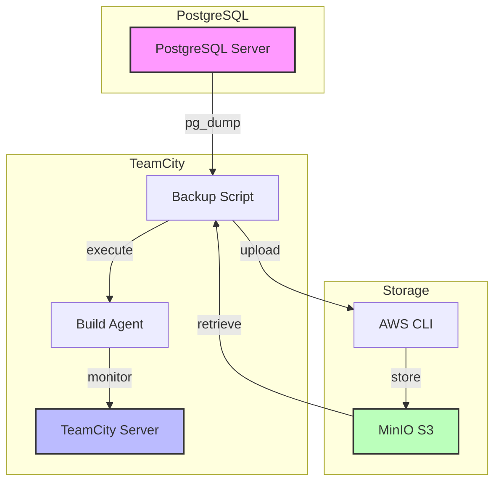
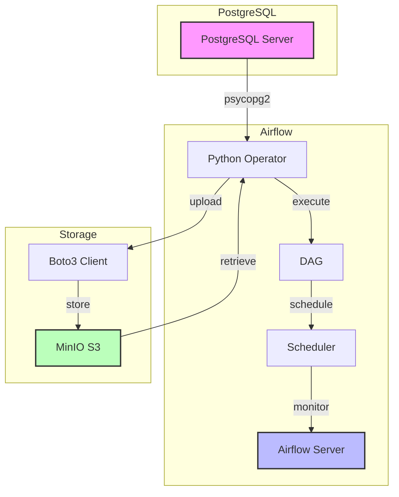
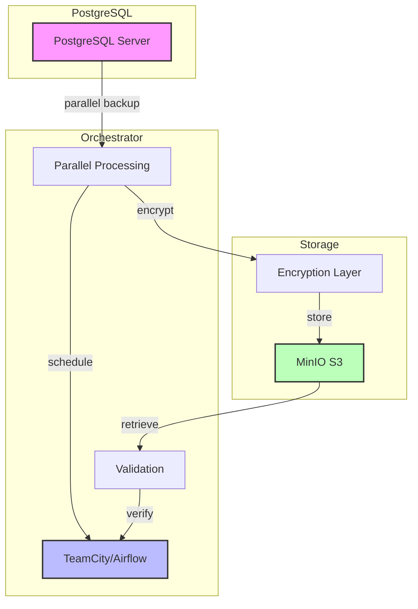
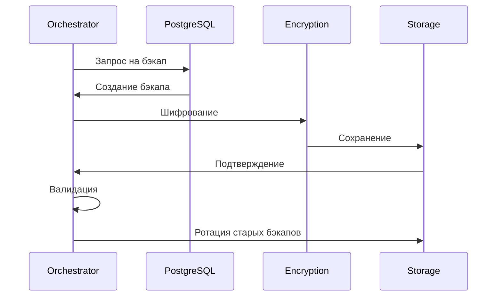

# PostgreSQL Backup and Restore Solution

Это решение для автоматического бэкапа и восстановления баз данных PostgreSQL с использованием TeamCity и Apache Airflow.

## Архитектура решений

### TeamCity Solution


### Airflow Solution


### Расширенная версия


### Процесс бэкапа


## Структура проекта

```
postgres-backup/
├── teamcity/
│   ├── backup_restore.sh    # Базовый скрипт для бэкапа и восстановления
│   ├── teamcity-config.xml  # Конфигурация TeamCity
│   └── advanced/
│       └── backup_restore_advanced.sh  # Расширенный скрипт с дополнительными возможностями
├── airflow/
│   ├── postgres_backup_dag.py  # Базовый DAG для Airflow
│   └── advanced/
│       └── postgres_backup_dag_advanced.py  # Расширенный DAG с дополнительными возможностями
└── requirements.txt        # Зависимости Python
```

## Требования

### Базовые требования
- PostgreSQL клиент (pg_dump, pg_restore)
- Python 3.8+
- MinIO сервер или совместимое S3 хранилище

### Дополнительные требования
- TeamCity (для TeamCity версии)
- Apache Airflow (для Airflow версии)
- AWS CLI (опционально, для ручной работы с MinIO)

## Установка

### 1. Установка базовых зависимостей
```bash
# Установка PostgreSQL клиента
# Для Ubuntu/Debian
sudo apt-get update
sudo apt-get install -y postgresql-client

# Для CentOS/RHEL
sudo yum install -y postgresql

# Установка Python зависимостей
pip install -r requirements.txt
```

### 2. Установка дополнительных зависимостей

#### Для TeamCity
```bash
# Установка AWS CLI (опционально)
pip install awscli
```

#### Для Airflow
```bash
# Установка Airflow и зависимостей
pip install apache-airflow>=2.6.0
```

### 3. Настройка MinIO
```bash
# Настройка AWS CLI для работы с MinIO
aws configure --profile minio
# Введите:
# - Access Key ID: ваш MinIO access key
# - Secret Access Key: ваш MinIO secret key
# - Default region: minio
# - Default output format: json
```

## Настройка переменных окружения

Необходимо настроить следующие переменные окружения:

```bash
# Стандартные параметры подключения к PostgreSQL
PG_HOST=your_postgres_host
PG_PORT=5432
PG_DB=your_database_name
PG_USER=your_postgres_user

# Альтернативный способ подключения через JDBC URL
PG_JDBC_URL=jdbc:postgresql://host:port/database?user=username&password=password

# Параметры MinIO
MINIO_ENDPOINT=https://minio.vanek-test.com
MINIO_ACCESS_KEY=your_access_key
MINIO_SECRET_KEY=your_secret_key
MINIO_BUCKET=your_bucket_name

# Дополнительные параметры для расширенной версии
BACKUP_RETENTION_DAYS=30  # Количество дней хранения бэкапов
PARALLEL_JOBS=4          # Количество параллельных процессов бэкапа
INCREMENTAL_BACKUP=false # Включение инкрементального бэкапа
LAST_FULL_BACKUP=        # Дата последнего полного бэкапа для инкрементального режима

# Параметры шифрования (опционально)
ENCRYPTION_METHOD=gpg    # Метод шифрования (gpg/kms/aes)
ENCRYPTION_KEY=          # Ключ для шифрования
```

## Выбор версии

### Базовая версия
Простая версия с основным функционалом:
- Ежедневный бэкап всей базы
- Хранение в MinIO
- Восстановление из последнего бэкапа

### Расширенная версия
Дополнительные возможности:
- Параллельный бэкап схем
- Инкрементальный бэкап измененных таблиц
- Ротация старых бэкапов
- Валидация бэкапов
- Настраиваемое количество параллельных процессов
- Настраиваемый срок хранения бэкапов

## Шифрование бэкапов

Решение поддерживает несколько методов шифрования бэкапов:

### 1. Шифрование на уровне файла (PGP/GPG)
```bash
# Пример команды для шифрования бэкапа
pg_dump ... | gzip | gpg --encrypt --recipient "backup@example.com" > backup.sql.gz.gpg

# Для расшифровки
gpg --decrypt backup.sql.gz.gpg | gunzip | psql ...
```
Преимущества:
- Простота реализации
- Можно использовать существующие ключи GPG
- Поддержка асимметричного шифрования
- Возможность хранения ключей отдельно от бэкапов

### 2. Шифрование на уровне MinIO (Server-Side Encryption)
```bash
# Пример загрузки с SSE
aws s3 cp backup.sql.gz s3://bucket/backup.sql.gz --sse aws:kms --sse-kms-key-id arn:aws:kms:region:account:key/key-id
```
Преимущества:
- Прозрачное шифрование
- Интеграция с KMS
- Управление ключами через IAM
- Аудит использования ключей

### 3. Шифрование на уровне приложения (AES)
```python
from cryptography.fernet import Fernet

# Генерация ключа
key = Fernet.generate_key()
cipher_suite = Fernet(key)

# Шифрование
encrypted_data = cipher_suite.encrypt(backup_data)

# Расшифровка
decrypted_data = cipher_suite.decrypt(encrypted_data)
```
Преимущества:
- Полный контроль над процессом
- Возможность кастомной логики
- Независимость от внешних сервисов

### 4. Гибридный подход
```bash
# Шифрование данных + метаданных
pg_dump ... | gzip | gpg --encrypt | aws s3 cp - s3://bucket/backup.sql.gz.gpg --sse aws:kms
```
Преимущества:
- Двойная защита
- Гибкость в управлении ключами
- Возможность ротации ключей

### Управление ключами
- Хранение ключей в HashiCorp Vault
- Ротация ключей через KMS
- Аудит использования ключей
- Разделение доступа к ключам

### Безопасность
- Отдельные ключи для продакшена и тестов
- Автоматическая ротация ключей
- Мониторинг использования ключей
- Аудит операций с ключами

## Кастомные бэкапы в Airflow

### Настройка параметров подключения

В Airflow вы можете настроить параметры подключения двумя способами:

1. Через стандартные параметры:
```python
# В интерфейсе Airflow -> Admin -> Variables добавьте:
PG_HOST = 'your_host'
PG_PORT = '5432'
PG_DB = 'your_database'
PG_USER = 'your_user'
```

2. Через JDBC URL (для сложных конфигураций):
```python
# В интерфейсе Airflow -> Admin -> Variables добавьте:
PG_JDBC_URL = 'jdbc:postgresql://host:port/database?user=username&password=password&ssl=true'
```

### Дополнительные параметры для расширенной версии

```python
# В интерфейсе Airflow -> Admin -> Variables добавьте:
BACKUP_RETENTION_DAYS = '30'  # Хранение бэкапов 30 дней
PARALLEL_JOBS = '4'          # 4 параллельных процесса
INCREMENTAL_BACKUP = 'false' # Отключен инкрементальный бэкап
LAST_FULL_BACKUP = ''        # Дата последнего полного бэкапа
```

### Создание бэкапа конкретной базы

1. Через стандартные параметры:
```python
# В интерфейсе Airflow -> Admin -> Variables измените:
PG_DB = 'your_specific_database'
```

2. Через JDBC URL:
```python
# В интерфейсе Airflow -> Admin -> Variables добавьте:
PG_JDBC_URL = 'jdbc:postgresql://host:port/your_specific_database?user=username&password=password'
```

### Восстановление конкретного бэкапа

Вы можете восстановить конкретный бэкап по дате:

1. В интерфейсе Airflow найдите DAG `postgres_backup_dag_advanced`
2. Выберите задачу `restore_postgres`
3. Нажмите "Clear" и в появившемся окне добавьте параметр:
```json
{
    "backup_date": "20240315"  # Формат: YYYYMMDD
}
```

## TeamCity Solution

### Настройка

1. Скопируйте файлы из директории `teamcity/` в ваш проект TeamCity
2. Настройте параметры в `teamcity-config.xml`
3. Создайте два build configuration:
   - `postgres_backup_daily` - для ежедневного бэкапа
   - `postgres_restore` - для ручного восстановления

### Использование базовой версии

- Бэкап будет выполняться автоматически каждый день в полночь
- Восстановление доступно только через ручной запуск build configuration `postgres_restore`

### Использование расширенной версии

1. Скопируйте `backup_restore_advanced.sh` в ваш проект TeamCity
2. Настройте дополнительные параметры в переменных окружения:
```bash
BACKUP_RETENTION_DAYS=30
PARALLEL_JOBS=4
INCREMENTAL_BACKUP=false
LAST_FULL_BACKUP=
```

3. Создайте build configuration с использованием расширенного скрипта

## Airflow Solution

### Настройка

1. Скопируйте файл `postgres_backup_dag.py` или `postgres_backup_dag_advanced.py` в директорию DAGs вашего Airflow
2. Настройте переменные в интерфейсе Airflow (Admin -> Variables)
3. Перезапустите Airflow для загрузки нового DAG

### Использование базовой версии

- DAG будет выполняться автоматически каждый день в полночь
- Задача восстановления (`restore_postgres`) доступна только для ручного запуска

### Использование расширенной версии

- Параллельный бэкап схем для ускорения процесса
- Инкрементальный бэкап для экономии места
- Автоматическая ротация старых бэкапов
- Валидация бэкапов перед загрузкой и восстановлением

## Проверка работы и устранение проблем

Если у вас возникают проблемы, проверьте следующее:

1. Убедитесь, что PostgreSQL сервер доступен:
```bash
pg_isready -h $PG_HOST -p $PG_PORT -d $PG_DB -U $PG_USER
# или для JDBC URL
pg_isready -d "$PG_JDBC_URL"
```

2. Проверьте подключение к MinIO:
```bash
aws s3 ls --endpoint-url $MINIO_ENDPOINT --profile minio --no-verify-ssl
```

3. Проверьте наличие и права доступа к бакету:
```bash
aws s3 ls s3://$MINIO_BUCKET --endpoint-url $MINIO_ENDPOINT --profile minio --no-verify-ssl
```

4. Проверьте логи для получения дополнительной информации о проблемах:
   - В TeamCity - в логах сборки
   - В Airflow - в логах задач DAG

## Особенности

### Базовая версия
- Бэкапы сохраняются в сжатом виде (gzip)
- Хранение бэкапов в MinIO S3 с поддержкой path-style access
- Автоматическая очистка временных файлов
- Восстановление из последнего доступного бэкапа или конкретной даты
- Поддержка ручного восстановления
- Безопасная аутентификация через access key и secret key
- Поддержка JDBC URL для сложных конфигураций подключения
- Поддержка SSL и дополнительных параметров подключения
- Возможность восстановления на другую базу данных

### Расширенная версия
- Параллельный бэкап схем для ускорения процесса
- Инкрементальный бэкап измененных таблиц
- Автоматическая ротация старых бэкапов
- Валидация бэкапов перед загрузкой и восстановлением
- Настраиваемое количество параллельных процессов
- Настраиваемый срок хранения бэкапов
- Поддержка частичного восстановления
- Мониторинг изменений в таблицах
- Оптимизация использования ресурсов 