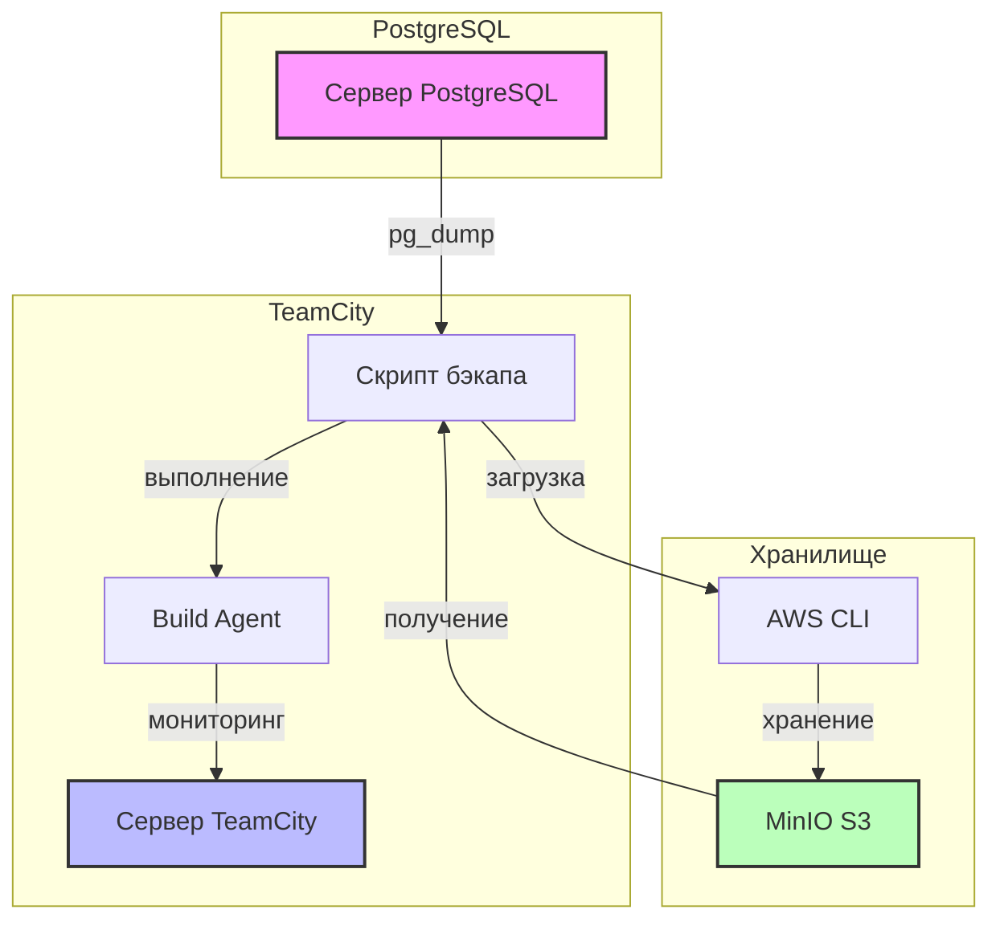
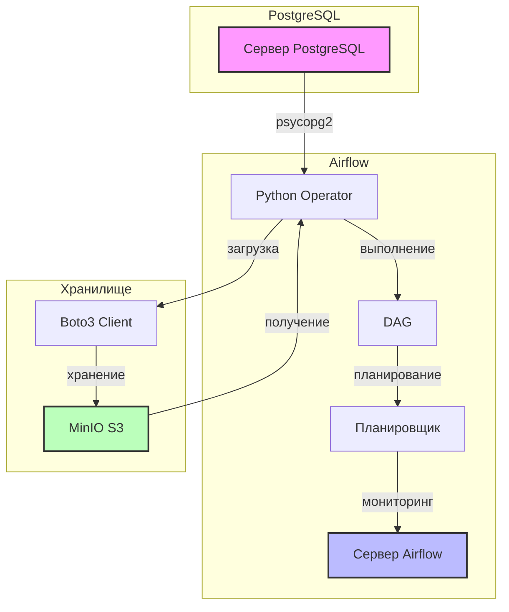
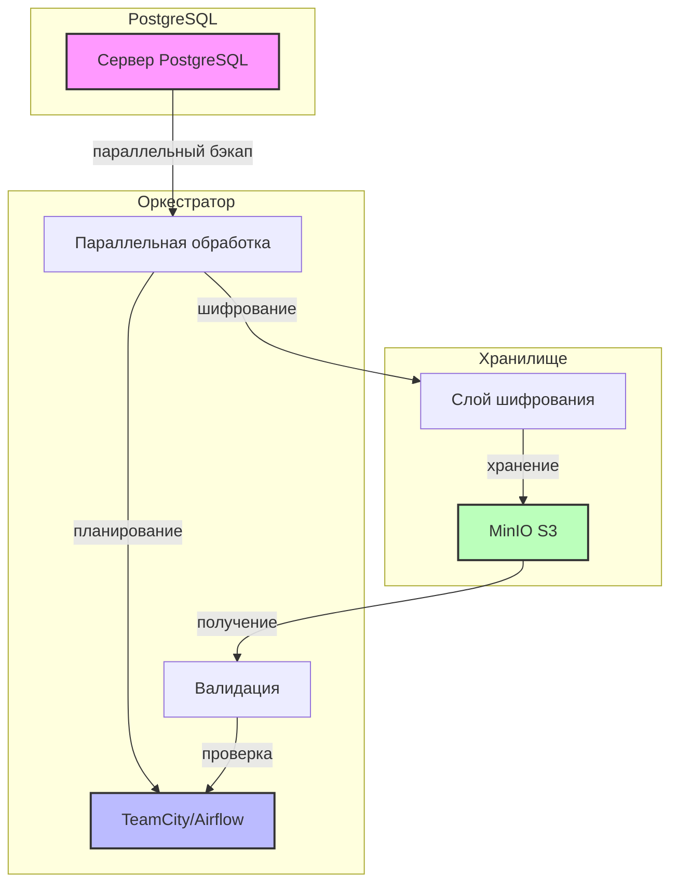
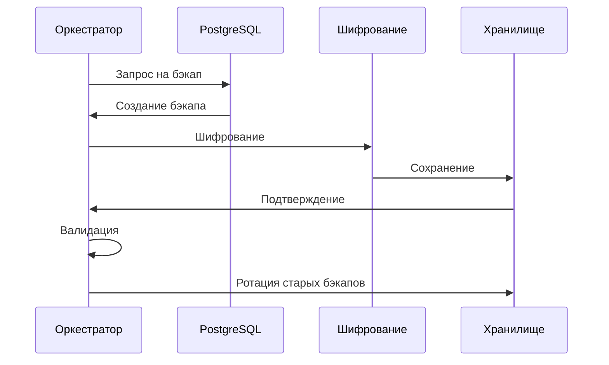

# Решение для бэкапа и восстановления PostgreSQL

Это решение предоставляет автоматизированные возможности бэкапа и восстановления баз данных PostgreSQL с двумя вариантами хранения:
1. **Облачное хранилище** (MinIO) - Основное решение
2. **Локальное хранилище** - Альтернативное решение

## Возможности

### Облачное решение
- Автоматический ежедневный бэкап
- Хранение в MinIO (S3-совместимое хранилище)
- Ротация бэкапов (хранение 30 дней)
- Поддержка TeamCity и Airflow
- Поддержка шифрования
- Мониторинг и оповещения

### Локальное решение
- Локальное хранение бэкапов
- Простая установка и настройка
- Базовая функциональность бэкапа и восстановления
- Поддержка TeamCity и Airflow
- Мониторинг свободного места на диске
- Безопасные права доступа к файлам

## Структура проекта

```
postgres-backuper/
├── airflow/                    # DAG и конфигурации Airflow
│   ├── postgres_backup_dag.py  # DAG для облачного хранилища
│   └── postgres_backup_dag_local.py  # DAG для локального хранилища
├── teamcity/                   # Конфигурации TeamCity
│   ├── backup_restore.sh       # Скрипт для облачного хранилища
│   └── backup_restore_local.sh # Скрипт для локального хранилища
├── local_storage/              # Локальное решение
│   ├── airflow/               # DAG для локального хранилища
│   ├── teamcity/              # Скрипты для локального хранилища
│   └── README.md              # Документация локального решения
├── requirements.txt            # Зависимости Python
└── README.md                   # Основная документация
```

## Требования

### Облачное решение
- Python 3.8+
- Клиентские инструменты PostgreSQL
- Сервер MinIO или совместимое S3 хранилище
- TeamCity или Apache Airflow
- Необходимые пакеты Python (см. requirements.txt)

### Локальное решение
- Клиентские инструменты PostgreSQL
- Доступ к директории `/var/lib/postgresql/backups`
- TeamCity или Apache Airflow
- Необходимые пакеты Python (см. requirements.txt)

## Установка

### Облачное решение
1. Установка зависимостей:
   ```bash
   pip install -r requirements.txt
   ```

2. Настройка переменных окружения:
   ```bash
   # PostgreSQL
   export PG_HOST=ваш_хост_postgres
   export PG_PORT=5432
   export PG_DB=ваша_база_данных
   export PG_USER=ваш_пользователь_postgres
   export PG_PASSWORD=ваш_пароль_postgres

   # MinIO
   export MINIO_ENDPOINT=ваш_эндпоинт_minio
   export MINIO_ACCESS_KEY=ваш_ключ_доступа
   export MINIO_SECRET_KEY=ваш_секретный_ключ
   export MINIO_BUCKET=ваш_бакет
   ```

3. Для TeamCity:
   - Скопируйте `teamcity/backup_restore.sh` в ваш проект
   - Настройте шаги сборки с использованием скрипта

4. Для Airflow:
   - Скопируйте `airflow/postgres_backup_dag.py` в директорию DAGs
   - Настройте переменные Airflow для базы данных и хранилища

### Локальное решение
1. Создание директории для бэкапов:
   ```bash
   sudo mkdir -p /var/lib/postgresql/backups
   sudo chown postgres:postgres /var/lib/postgresql/backups
   sudo chmod 700 /var/lib/postgresql/backups
   ```

2. Для TeamCity:
   - Скопируйте `local_storage/teamcity/backup_restore_local.sh` в ваш проект
   - Настройте шаги сборки с использованием скрипта

3. Для Airflow:
   - Скопируйте `local_storage/airflow/postgres_backup_dag_local.py` в директорию DAGs
   - Настройте переменные Airflow для базы данных

## Использование

### Облачное решение
#### TeamCity
```bash
# Создание бэкапа
./backup_restore.sh backup

# Восстановление из бэкапа
./backup_restore.sh restore backup_20240315_120000.sql.gz

# Список бэкапов
./backup_restore.sh list
```

#### Airflow
- DAG выполняется ежедневно в 00:00 UTC
- Автоматическая ротация бэкапов
- Email-уведомления при ошибках

### Локальное решение
#### TeamCity
```bash
# Создание бэкапа
./backup_restore_local.sh backup

# Восстановление из бэкапа
./backup_restore_local.sh restore /var/lib/postgresql/backups/backup_20240315_120000.sql.gz

# Список бэкапов
./backup_restore_local.sh list
```

#### Airflow
- DAG выполняется ежедневно
- Автоматическая ротация бэкапов
- Мониторинг свободного места на диске
- Email-уведомления при ошибках

## Безопасность

### Облачное решение
- Серверное шифрование в MinIO
- Безопасное управление учетными данными
- Контроль доступа через IAM политики
- Валидация бэкапов

### Локальное решение
- Безопасные права доступа к файлам (600 для файлов, 700 для директории)
- Владелец файлов - пользователь postgres
- Регулярная ротация бэкапов
- Мониторинг свободного места на диске

## Мониторинг

### Облачное решение
- Метрики MinIO
- Уведомления об успехе/ошибках бэкапа
- Мониторинг использования хранилища
- Логи валидации бэкапов

### Локальное решение
- Мониторинг свободного места на диске
- Проверка прав доступа к файлам бэкапов
- Логи ротации бэкапов
- Отслеживание использования хранилища

## Архитектура

### Облачное решение


### Решение с Airflow


### Расширенная версия


### Процесс бэкапа


## Вклад в проект
Приветствуются предложения по улучшению и сообщения об ошибках!

## Последние изменения

### Улучшения в Airflow DAG
- Переход на использование Airflow Connections вместо Variables для хранения конфиденциальных данных
- Улучшенная обработка ошибок с использованием AirflowException
- Более безопасное выполнение команд через subprocess.run
- Улучшенный мониторинг свободного места на диске
- Расширенная документация функций

### Настройка Airflow Connections
Для работы с новыми DAG необходимо настроить следующие Connections в Airflow:

1. PostgreSQL Connection:
   - Connection ID: `postgres_default`
   - Connection Type: `Postgres`
   - Host: ваш хост PostgreSQL
   - Schema: ваша база данных
   - Login: ваш пользователь PostgreSQL
   - Password: ваш пароль PostgreSQL
   - Port: порт PostgreSQL (по умолчанию 5432)

2. MinIO Connection (для облачного решения):
   - Connection ID: `minio_default`
   - Connection Type: `S3`
   - Host: ваш эндпоинт MinIO
   - Login: ваш ключ доступа MinIO
   - Password: ваш секретный ключ MinIO

### Переменные Airflow
Для дополнительной конфигурации используются следующие переменные:
- `MINIO_BUCKET`: имя бакета для хранения бэкапов
- `MINIO_BACKUP_PATH`: путь в бакете для хранения бэкапов (по умолчанию 'backups/postgres')
- `PARALLEL_JOBS`: количество параллельных задач (по умолчанию 4)
- `INCREMENTAL_BACKUP`: включение инкрементальных бэкапов (true/false)
- `LAST_FULL_BACKUP`: дата последнего полного бэкапа 