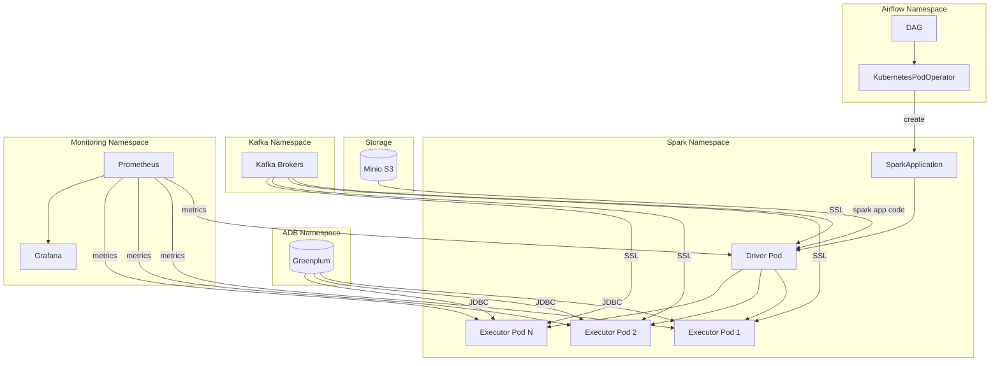

# Spark Data Mesh: Kafka to ADB Pipeline

## Архитектура решения

## Компоненты системы

### 1. Airflow DAG
- Управляет запуском Spark задания
- Использует KubernetesPodOperator для создания SparkApplication
- Обеспечивает мониторинг и обработку ошибок
- Передает параметры подключения через переменные окружения

### 2. Spark Application
- Читает данные из Kafka с использованием SSL
- Обрабатывает данные (JSON парсинг и трансформации)
- Записывает результаты в Greenplum через JDBC
- Предоставляет метрики для Prometheus

### 3. Kubernetes Resources
- RBAC настройки для Spark operator
- Network Policies для безопасности
- Secrets для хранения сертификатов
- Resource Quotas и Limits

## Безопасность

### SSL/TLS для Kafka
- Сертификаты хранятся в Kubernetes Secrets
- Монтируются в поды Spark
- Регулярная ротация сертификатов

### Network Policies
- Ограничение доступа между namespace
- Разрешение только необходимых портов
- Изоляция компонентов

### Secrets Management
- Безопасное хранение учетных данных
- Доступ только для авторизованных подов
- Интеграция с внешними системами управления секретами

## Мониторинг и Логирование

### Prometheus Metrics
- JVM метрики
- Spark метрики
- Kafka метрики
- Метрики производительности

### Grafana Dashboards
- Визуализация метрик
- Алерты
- Тренды и аномалии

### Логирование
- Структурированные логи
- Уровни логирования
- Централизованный сбор логов

## Производительность

### Spark Tuning
- Оптимизация памяти
- Настройка партиционирования
- Динамическая аллокация ресурсов

### Kafka Optimization
- Настройка batch size
- Оптимизация fetch size
- Параллельное чтение

### Greenplum Integration
- Оптимизация batch size
- Connection pooling
- Изоляция транзакций

## Отказоустойчивость

### Retry Policies
- Автоматические повторы при ошибках
- Экспоненциальная задержка
- Максимальное количество попыток

### Data Consistency
- Идемпотентность операций
- Проверка целостности данных
- Транзакционность записи

### High Availability
- Распределение нагрузки
- Автоматическое восстановление
- Резервное копирование

## Рекомендации по развертыванию

### Подготовка окружения
1. Создать необходимые namespace
2. Настроить RBAC
3. Создать secrets для сертификатов
4. Настроить Network Policies

### Установка компонентов
1. Развернуть Spark Operator
2. Настроить Prometheus и Grafana
3. Создать Airflow connections
4. Загрузить Spark приложение в Minio

### Проверка работоспособности
1. Проверить доступность всех сервисов
2. Протестировать SSL подключение
3. Проверить права доступа
4. Запустить тестовый DAG

## Рекомендации по эксплуатации

### Мониторинг
- Настроить алерты на критические ошибки
- Отслеживать метрики производительности
- Анализировать тренды использования ресурсов

### Обслуживание
- Регулярное обновление сертификатов
- Очистка устаревших данных
- Обновление версий компонентов

### Масштабирование
- Мониторинг нагрузки
- Настройка автомасштабирования
- Оптимизация ресурсов

## Troubleshooting

### Частые проблемы
1. Проблемы с SSL сертификатами
2. Ошибки подключения к Kafka
3. Проблемы с правами доступа
4. Нехватка ресурсов

### Диагностика
1. Проверка логов Spark Driver
2. Анализ метрик Prometheus
3. Проверка Network Policies
4. Валидация сертификатов

### Решение проблем
1. Проверка конфигурации
2. Анализ логов
3. Тестирование подключений
4. Проверка ресурсов

## Дальнейшие улучшения

### Безопасность
- Внедрение Vault для управления секретами
- Усиление network policies
- Регулярный аудит безопасности

### Производительность
- Оптимизация конфигурации Spark
- Улучшение схемы партиционирования
- Настройка кэширования

### Мониторинг
- Расширение набора метрик
- Улучшение дашбордов
- Автоматизация отчетности

### Автоматизация
- CI/CD для обновлений
- Автоматическая ротация сертификатов
- Автоматическое тестирование 